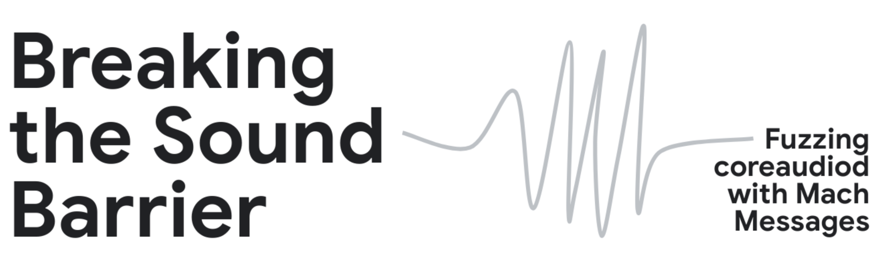

## Overview

This repository contains an open-source fuzzing harness designed to fuzz Apple's CoreAudio framework using Mach messages. The harness integrates with [Jackalope](https://github.com/googleprojectzero/Jackalope) and [TinyInst](https://github.com/googleprojectzero/TinyInst) to facilitate black box dynamic instrumentation and fuzzing. This work serves as a companion to my [Project Zero Blog Post](https://googleprojectzero.blogspot.com/2025/05/breaking-sound-barrier-part-i-fuzzing.html), demonstrating how to identify and analyze vulnerabilities in macOS's `coreaudiod` process.

## Features
- **Fuzzing Harness**: A specialized harness for fuzzing CoreAudio via Mach messages.
- **Jackalope Integration**: Uses Jackalope for testcase management and corpus mutation.
- **Custom Function Hooks**: Contains custom function hooks to bypass areas creating fuzzing bottlenecks.
- **TinyInst Support**: Enables lightweight dynamic instrumentation to track coverage.
- **Reproducibility**: Allows others to replicate my fuzzing setup and extend research efforts.

## Building the Harness

### Prerequisites
Ensure you have the following dependencies installed:
- macOS (tested on latest stable versions)
- Xcode and Command Line Tools
    - Make sure you have launched Xcode at least once
- CMake
- Clang

### Building the Fuzzing Harness
```
make
```
### Building Jackalope fuzzer with Custom Function Hooks
```
cd jackalope-modifications
git clone https://github.com/googleprojectzero/Jackalope.git
cd Jackalope
git clone --recurse-submodules https://github.com/googleprojectzero/TinyInst.git
cd ..
mkdir build
cd build
cmake -G Xcode ..
cmake --build . --config Release
```
**Note:** The custom function hook instrumentation is specifically designed to be run on x86 MacOS systems

## Usage

### Running the Fuzzing Harness
- `unzip` the provided `corpus.zip` file to use high-quality input samples generated during the research
- The provided `run.sh` script will run the freshly built `coreaudiofuzzer` with my fuzzing harness, corpus, and function hooks applied
```
./run.sh
```

## Vulnerabilities Discovered
- [CVE-2024-54529](https://nvd.nist.gov/vuln/detail/CVE-2024-54529) (Type Confusion in CoreAudio)
- [CVE-2025-31235](https://nvd.nist.gov/vuln/detail/CVE-2025-31235) (Double Free in CoreAudio)

## Contributing
Contributions are welcome! Feel free to open issues and pull requests to improve the harness or expand its functionality.

## Contact
For questions or discussions, feel free to reach out via GitHub issues or contact me directly.

---

