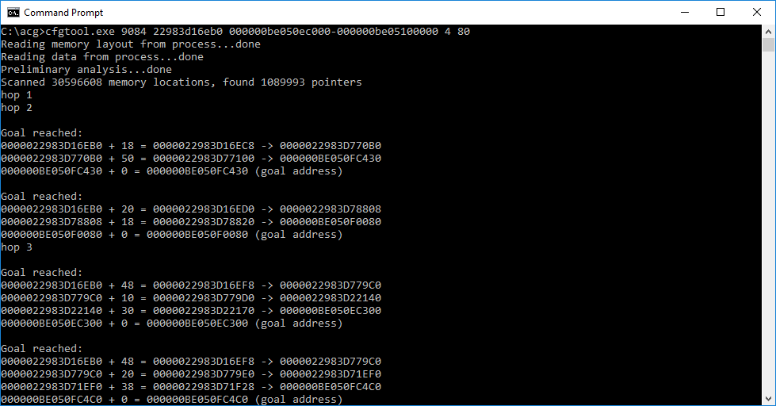
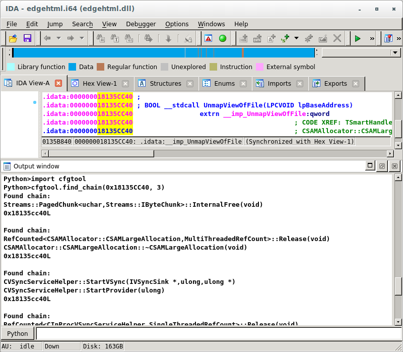
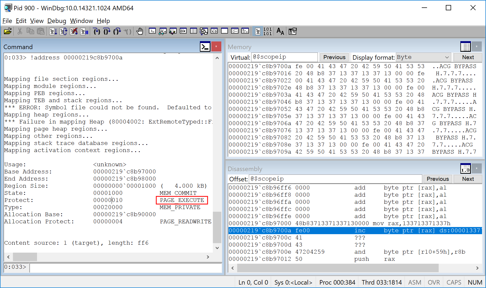

# Bypassing Mitigations by Attacking JIT Server in Microsoft Edge

## Documents

JIT-Server-whitepaper.pdf contains the Project Zero whitepaper "Bypassing Mitigations by Attacking JIT Server in Microsoft Edge"

JIT-Server-presentation.pdf contains a presentation of the same name that was given at the Infiltrate 2018 security conference.

## Tools

### cfgtool.cpp

cfgtool.cpp is a tool for finding CFG bypasses that rely on return address overwrite in Windows applications. Given a process, start memory address and a target memory address range, it finds a chain of pointers from the start address to the target memory. When an attacker has an arbitrary read primitive in the target application, this is useful for finding a chain of pointers one needs to follow to obtain the stack address, starting from a selected arbitrary read starting point.

Usage:

Attach a debugger to the target process, and after finding a good start address and stak target range, run

`cfgtool <pid> <startaddress> <goal address range> <max hops> <max offset>`

Example:

`cfgtool 9084 0000022983d16eb0 000000be050ec000-000000be05100000 4 80`



By default, the tool doesn't know where the allocation boundaries are. To prevent it from skipping allocation boundaries, the tool can be run with Page Heap enabled for the target process.

64-bit build of the tool should be used on 64-bit targets and vice versa.

### cfgtool.py

cfgtool.py is an IDAPython tool that makes it easier to call arbitrary functions *without* having to bypass CFG. Given a target function, it finds all *CFG-allowed* functions that call the target function somewhere in their call chain.

Basic usage:

```
sys.path.append(<directory containing cfgtool.py>)
import cfgtool
cfgtool.find_chain(<target address>, <maximum depth>)
```

Example:



## Exploit code

acgpoc1.html contains a proof of concept exploit for bypassing ACG using [a logic bug in the Chakra JIT Server](https://bugs.chromium.org/p/project-zero/issues/detail?id=1435). This version of the exploit first bypasses CFG by relying on a return address overwrite in order to call Windows API functions needed to exploit the issue.

acgpoc2.html contains a proof of concept exploit for bypassing ACG using the same bug. This version of the exploit does not rely on a separate CFG bypass and calls only CFG-allowed functions before achieving arbitrary code execution.



Note that both versions of the exploit were developed against the most recent version of Windows at the time the bug was found (Windows 10 version 1709 with November 2017 patches installed). Running it on other Windows/update versions might require modifying some offsets (Gadgets in .dlls are found dynamically, however offsets of data members in Chakra structures might change from version to version).

